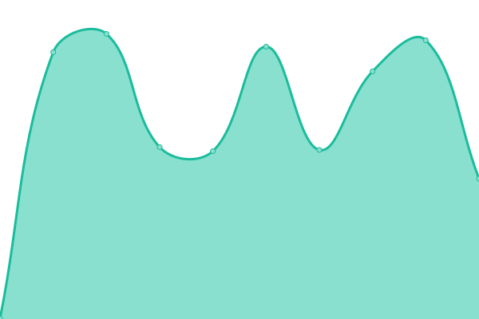
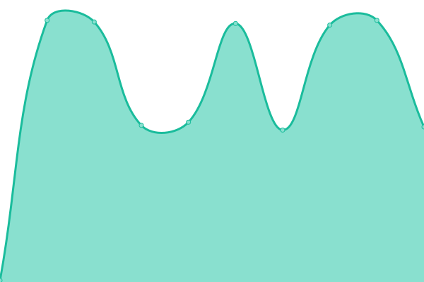
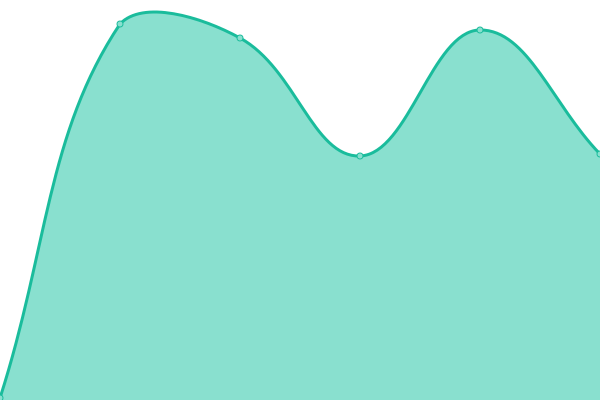
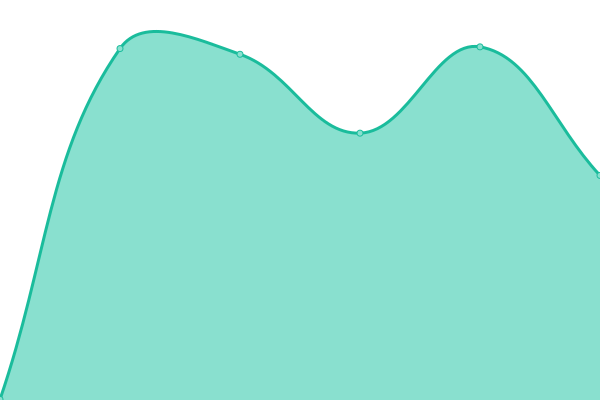
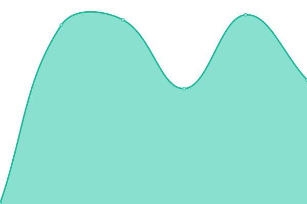
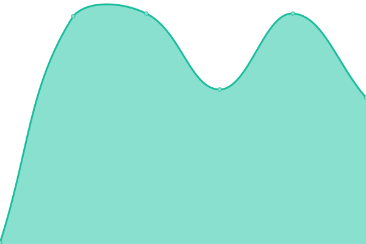

# [📈 Live Status](https://status.p17o.com): <!--live status--> **🟩 All systems operational**

This repository contains the open-source uptime monitor and status page for [p17o](https://status.p17o.com), powered by [Upptime](https://github.com/upptime/upptime).

With [Upptime](https://upptime.js.org), you can get your own unlimited and free uptime monitor and status page, powered entirely by a GitHub repository. We use [Issues](https://github.com/p17o/nym-nodes-upptime/issues) as incident reports, [Actions](https://github.com/p17o/nym-nodes-upptime/actions) as uptime monitors, and [Pages](https://status.p17o.com) for the status page.

<!--start: status pages-->
<!-- This summary is generated by Upptime (https://github.com/upptime/upptime) -->
<!-- Do not edit this manually, your changes will be overwritten -->
<!-- prettier-ignore -->
| URL | Status | History | Response Time | Uptime |
| --- | ------ | ------- | ------------- | ------ |
|  [nym-node ch - swagger API](https://nym-exit.ch-node1.p17o.com/api/v1/swagger/#/) | 🟩 Up | [nym-node-ch-swagger-api.yml](https://github.com/p17o/nym-nodes-upptime/commits/HEAD/history/nym-node-ch-swagger-api.yml) | 

 557ms
     
 | 

<a href="https://status.p17o.com/history/nym-node-ch-swagger-api">100.00%</a>
    

|  [nym-node ch - landing page](https://nym-exit.ch-node1.p17o.com/) | 🟩 Up | [nym-node-ch-landing-page.yml](https://github.com/p17o/nym-nodes-upptime/commits/HEAD/history/nym-node-ch-landing-page.yml) | 

 136ms
     
 | 

<a href="https://status.p17o.com/history/nym-node-ch-landing-page">100.00%</a>
    

|  [nym-node pt - swagger API](https://nym-exit.pt-node1.p17o.com/api/v1/swagger/#/) | 🟩 Up | [nym-node-pt-swagger-api.yml](https://github.com/p17o/nym-nodes-upptime/commits/HEAD/history/nym-node-pt-swagger-api.yml) | 

 612ms
     
 | 

<a href="https://status.p17o.com/history/nym-node-pt-swagger-api">100.00%</a>
    

|  [nym-node pt - landing page](https://nym-exit.pt-node1.p17o.com/) | 🟩 Up | [nym-node-pt-landing-page.yml](https://github.com/p17o/nym-nodes-upptime/commits/HEAD/history/nym-node-pt-landing-page.yml) | 

 160ms
     
 | 

<a href="https://status.p17o.com/history/nym-node-pt-landing-page">100.00%</a>
    

|  [nym-node fr - swagger API](https://nym-exit.fr-node1.p17o.com/api/v1/swagger/#/) | 🟩 Up | [nym-node-fr-swagger-api.yml](https://github.com/p17o/nym-nodes-upptime/commits/HEAD/history/nym-node-fr-swagger-api.yml) | 

 540ms
     
 | 

<a href="https://status.p17o.com/history/nym-node-fr-swagger-api">100.00%</a>
    

|  [nym-node fr - landing page](https://nym-exit.fr-node1.p17o.com/) | 🟩 Up | [nym-node-fr-landing-page.yml](https://github.com/p17o/nym-nodes-upptime/commits/HEAD/history/nym-node-fr-landing-page.yml) | 

 131ms
     
 | 

<a href="https://status.p17o.com/history/nym-node-fr-landing-page">100.00%</a>
    

|  [nym-node pl - swagger API](https://nym-exit.pl-node1.p17o.com/api/v1/swagger/#/) | 🟩 Up | [nym-node-pl-swagger-api.yml](https://github.com/p17o/nym-nodes-upptime/commits/HEAD/history/nym-node-pl-swagger-api.yml) | 

 543ms
     
 | 

<a href="https://status.p17o.com/history/nym-node-pl-swagger-api">100.00%</a>
    

|  [nym-node pl - landing page](https://nym-exit.pl-node1.p17o.com/) | 🟩 Up | [nym-node-pl-landing-page.yml](https://github.com/p17o/nym-nodes-upptime/commits/HEAD/history/nym-node-pl-landing-page.yml) | 

 146ms
     
 | 

<a href="https://status.p17o.com/history/nym-node-pl-landing-page">100.00%</a>
    

<!--end: status pages-->

[**Visit our status website →**](https://status.p17o.com)

## 📄 License

- Powered by: [Upptime](https://github.com/upptime/upptime)
- Code: [MIT](./LICENSE) © [Anand Chowdhary](https://anandchowdhary.com), supported by [Pabio](https://pabio.com)
- Data in the `./history` directory: [Open Database License](https://opendatacommons.org/licenses/odbl/1-0/)
